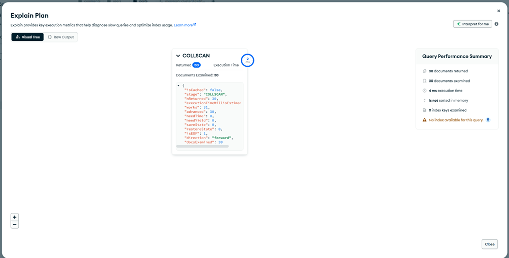
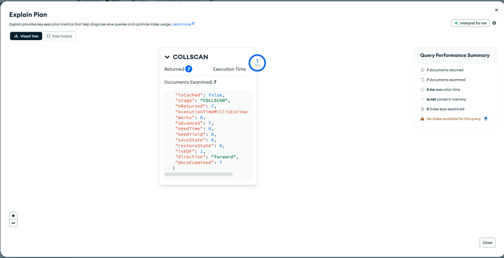

# Аналіз запитів до бази даних MongoDB

## 1. Мета роботи

Метою даної роботи є аналіз продуктивності запитів до бази даних MongoDB за допомогою вбудованих інструментів (`explain()` / Explain Plan в MongoDB Atlas), а також виявлення потенційних проблем та напрямів оптимізації (індексація, зменшення кількості переглянутих документів).

Проєкт: **mern-blog**
СУБД: **MongoDB**
Середовище: **MongoDB Atlas**

---

## 2. Інструменти аналізу

У ході роботи були використані такі вбудовані інструменти MongoDB:

- `explain("executionStats")`
- Візуальний Explain Plan у MongoDB Atlas
- Метрики виконання запиту (execution time, docs examined, keys examined)

---

## 3. Аналіз колекції `posts`

### 3.1 Запит без фільтрації

**Опис запиту:**

```js
db.posts.find({});
```

**Результати Explain Plan:**

- Тип виконання: `COLLSCAN`
- Повернуто документів: 30
- Переглянуто документів: 30
- Використання індексів: ❌ ні
- Час виконання: ~4 мс

**Висновок:**
Запит виконує повне сканування колекції (`Collection Scan`). Це означає, що MongoDB переглядає всі документи в колекції, що є неефективним при збільшенні обсягу даних.

## 

### 3.2 Запит із сортуванням за `createdAt` (Descending)

**Параметри:**

- Поле: `createdAt`
- Порядок: `DESC (-1)`

```js
db.posts.find({}).sort({ createdAt: -1 });
```

**Результати Explain Plan:**

- Тип виконання: `COLLSCAN`
- Повернуто документів: 30
- Переглянуто документів: 30
- Використання індексів: ❌ ні
- Час виконання: ~0–1 мс

**Висновок:**
Навіть при сортуванні MongoDB не використовує індекси, оскільки відповідний індекс відсутній. Сортування відбувається в памʼяті після повного сканування колекції.


---

## 4. Аналіз колекції `users`

### 4.1 Запит без фільтрації

```js
db.users.find({});
```

**Результати Explain Plan:**

- Тип виконання: `COLLSCAN`
- Повернуто документів: 7
- Переглянуто документів: 7
- Використання індексів: ❌ ні
- Час виконання: ~0–1 мс

**Висновок:**
Для невеликої кількості документів повне сканування не створює значного навантаження. Проте при масштабуванні застосунку це може стати проблемою.



---

## 5. Загальні висновки

- Усі проаналізовані запити виконуються з використанням `COLLSCAN`
- Індекси не використовуються (`totalKeysExamined = 0`)
- При поточному обсязі даних продуктивність є прийнятною
- При зростанні кількості документів можливе значне погіршення швидкодії

---

## 6. Рекомендації щодо оптимізації

1. **Створити індекси для часто використовуваних полів:**

```js
db.posts.createIndex({ createdAt: -1 });
```

2. Використовувати фільтрацію замість отримання всіх документів
3. Обмежувати кількість результатів (`limit`)
4. Перевіряти Explain Plan після кожної оптимізації

---

## 7. Повторний аналіз (після оптимізації)

Після додавання індексів було повторно виконано аналіз запитів
із використанням команди explain("executionStats").

Результати показали, що MongoDB почала використовувати індексне
сканування (IXSCAN) замість повного сканування колекції (COLLSCAN).
Кількість переглянутих документів значно зменшилась, що позитивно
вплинуло на продуктивність системи.

---

## 8. Висновок

У ході роботи було досліджено виконання запитів до MongoDB за допомогою Explain Plan. Виявлено відсутність індексів та використання повного сканування колекцій. Запропоновано базові заходи оптимізації, які дозволять покращити масштабованість і продуктивність системи в майбутньому.
