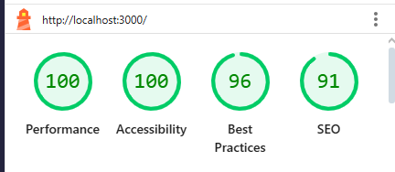
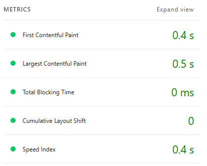
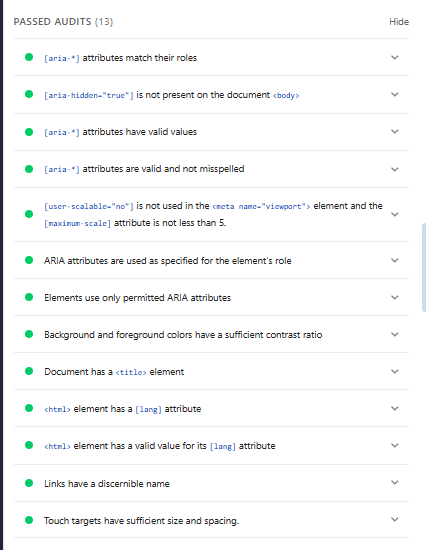
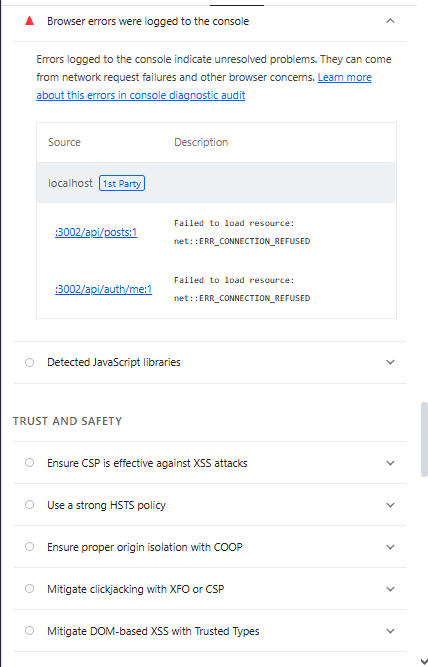
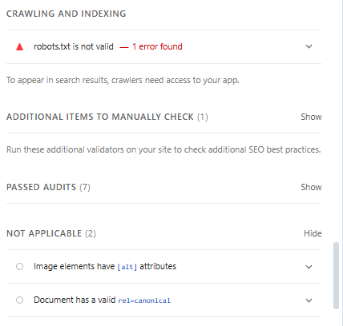

# Аналіз якості фронтенду вебзастосунку

## 1. Опис проєкту
Проєкт є fullstack вебзастосунком, frontend частина якого реалізована
як SPA з використанням React, Redux Toolkit та Tailwind CSS.
Застосунок надає можливість перегляду, створення та коментування постів.

## 2. Мета роботи
Метою роботи є аналіз якості frontend-частини вебзастосунку з точки зору
продуктивності, доступності, відповідності best practices та SEO
з використанням сучасних інструментів аудиту.

## 3. Використані інструменти
Для аналізу були використані такі інструменти:
- Google Lighthouse (Chrome DevTools)
- Web Vitals (web.dev)
- Lighthouse CI (ознайомлення з підходом автоматизації)

## 4. Методика аналізу
Аналіз проводився локально для production-білду застосунку.
Frontend було зібрано за допомогою команди `npm run build` та запущено
через статичний сервер (`serve -s build`).
Оцінювання виконувалося у середовищі Google Chrome.

## 5. Результати Lighthouse
За результатами аналізу було отримано такі оцінки:

| Категорія | Оцінка |
|----------|--------|
| Performance | 100 |
| Accessibility | 100 |
| Best Practices | 96 |
| SEO | 91 |

Отримані результати свідчать про високий рівень оптимізації frontend-частини.

## 6. Аналіз продуктивності (Performance)

Основні метрики продуктивності:
- **First Contentful Paint (FCP)** – 0.4 с
- **Largest Contentful Paint (LCP)** – 0.5 с
- **Total Blocking Time (TBT)** – 0 мс
- **Cumulative Layout Shift (CLS)** – 0
- **Speed Index** – 0.4 с

Значення метрик знаходяться в межах рекомендованих Google,
що свідчить про швидке завантаження та стабільність інтерфейсу.

### Виявлені рекомендації:
- Наявні render-blocking ресурси (Google Fonts, CSS)
- Відсутні cache lifetime для статичних ресурсів
- Частково не використовується JavaScript

## 7. Core Web Vitals
Аналіз Core Web Vitals показав:
- **LCP** знаходиться в межах норми завдяки невеликому розміру контенту
- **CLS** дорівнює 0, що означає відсутність зсувів макету
- **INP** не викликає проблем при взаємодії з інтерфейсом

## 8. Доступність (Accessibility)

Оцінка доступності склала 100 балів.
Основні перевірки показали:
- наявність атрибута `lang` у HTML-документі
- достатній контраст тексту
- коректне використання ARIA-атрибутів
- доступність навігації з клавіатури

Автоматичні перевірки не виявили критичних проблем доступності.

## 9. Best Practices

Оцінка Best Practices – 96 балів.

### Виявлені проблеми:
- Помилки у консолі браузера, пов’язані з недоступністю backend API
  (ERR_CONNECTION_REFUSED), що зумовлено локальним запуском frontend без сервера
- Відсутність деяких security headers (CSP, HSTS), що є типовим для SPA

## 10. SEO

Оцінка SEO – 91 бал.

### Виявлені проблеми:
- Некоректний файл `robots.txt`
- Застосунок є SPA без серверного рендерингу, що може обмежувати індексацію
- Використовується стандартний meta description

## 11. Рекомендації щодо покращення
Для подальшого підвищення якості frontend-частини рекомендовано:
- Додати кешування для статичних ресурсів
- Оптимізувати підключення шрифтів (self-hosted fonts)
- Виправити та налаштувати файл `robots.txt`
- Додати розширені SEO-метадані
- Реалізувати code splitting для зменшення JavaScript bundle
- Розглянути можливість SSR або prerendering для покращення SEO

## 12. Висновок
Lighthouse CI розглядався як інструмент для автоматизації перевірки
якості фронтенду у CI/CD пайплайні, однак для поточного аналізу
було використано інтерактивний запуск Google Lighthouse у Chrome DevTools.

В результаті виконання аналізу було встановлено, що frontend-частина
вебзастосунку має високі показники продуктивності, доступності та
відповідає основним best practices. Виявлені проблеми не є критичними
та можуть бути усунені шляхом подальшої оптимізації.
